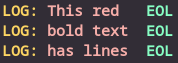
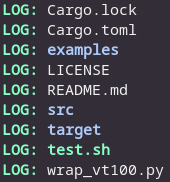

# wrap-vt100

Copyright (c) 2021 [Antmicro](https://www.antmicro.com/)

A simple application that allows prepending and appending input lines without affecting input stream escape codes.

# Usage

In order to use wrap-vt100, follow the steps below.

```
# Build the code in release mode
cargo build --release

# The binary appears here
ls target/release/wrap-vt100

# (optional) Install the binary to $HOME/.cargo/bin
cargo install --path .
```

Additionally, a subprocess-based [Python wrapper](wrap_vt100.py) is provided.

# Examples

The example below will print a line with the bold red ANSI code in the beginning.
Each line will be prefixed and suffixed with some colored string.

```sh
echo -e '\x1b[1;31mThis red\nbold text\nhas lines' | cargo run --quiet | cargo run --example line-appender --quiet -- "$(echo -e "\x1b[1;33mLOG:\x1b[0m ")" "$(echo -e "\t\x1b[1;32mEOL\x1b[0m")"
```



Even though only the first line contains the escape sequence, the state is preserved.

```
^[[1;33mLOG:^[[0m ^[[1;31mThis red^[[0m ^[[1;32mEOL^[[0m$
^[[1;33mLOG:^[[0m ^[[1;31mbold text^[[0m        ^[[1;32mEOL^[[0m$
^[[1;33mLOG:^[[0m ^[[1;31mhas lines^[[0m        ^[[1;32mEOL^[[0m$
```

The second example will show the directory listing with colored output.

```sh
ls --color=always | cargo run --quiet | cargo run --example line-appender --quiet -- "$(echo -e "\x1b[1;32mLOG:\x1b[0m ")"
```



This example demonstrates that the state vector is emptied if a reset sequence is detected, thus not carrying unnecessary state.

```
^[[1;32mLOG:^[[0m Cargo.lock^[[0m$
^[[1;32mLOG:^[[0m Cargo.toml^[[0m$
^[[1;32mLOG:^[[0m ^[[0m^[[1;34mexamples^[[0m^[[0m$
^[[1;32mLOG:^[[0m LICENSE^[[0m$
^[[1;32mLOG:^[[0m README.md^[[0m$
^[[1;32mLOG:^[[0m ^[[1;34msrc^[[0m^[[0m$
^[[1;32mLOG:^[[0m ^[[1;34mtarget^[[0m^[[0m$
^[[1;32mLOG:^[[0m ^[[1;32mtest.sh^[[0m^[[0m$
^[[1;32mLOG:^[[0m wrap_vt100.py^[[0m$
```

